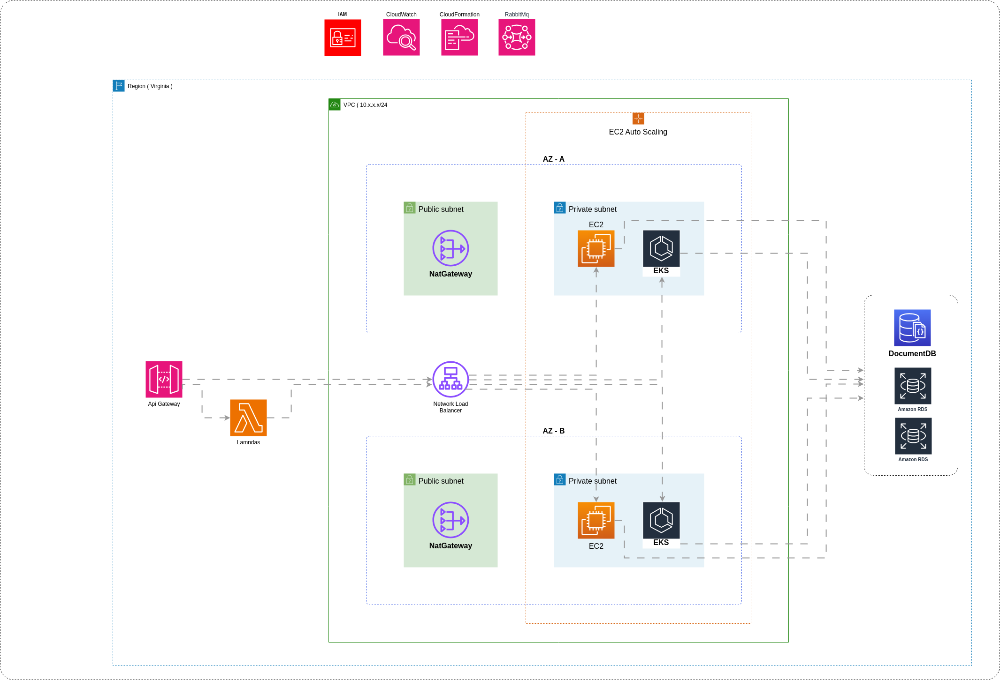

[](https://registry.terraform.io/modules/seu-nome-de-usuario/seu-modulo)
[](https://aws.amazon.com/)

# Tech Challenge - Fase 05 (GRUPO 31) - AWS Infraestrutura

Este repositório o terraform para criação dos seguintes itens:

* 1 VPC
* 3 subnets públicas
* 3 subnets privadas
* 1 Nat Gateway
* 1 Internet Gateway
* 1 Cluster EKS
* 2 grupo de nós com 1 ec2 em cada
* Roles necessárias para o EKS e Ec2 do grupo de nós



## Requisitos

* [Terraform](https://www.terraform.io/) - Terraform is an open-source infrastructure as code software tool that provides a consistent CLI workflow to manage hundreds of cloud services. Terraform codifies cloud APIs into declarative configuration files.
* [Amazon AWS Account](https://aws.amazon.com/it/console/) - Amazon AWS account with billing enabled
* [aws cli](https://aws.amazon.com/cli/) optional

## Antes de começar

Esta execução esta fora do nível gratuito da AWS, importante avaliar antes de executar

## AWS configuração

Com os requisitos já identificados, configure abaixo no secrets do github.

```
AWS_ACCESS_KEY = "xxxxxxxxxxxxxxxxx"
AWS_SECRET_KEY = "xxxxxxxxxxxxxxxxx"
```

## Uso

Com os requisitos já identificados, configure abaixo no secrets do github.

```
      - name: Checkout do repositório
        uses: actions/checkout@v2
    
      - name: Configurando a AWS Credentials Action para o GitHub Actions
        uses: aws-actions/configure-aws-credentials@v1
        with:
          aws-access-key-id: ${{ secrets.AWS_ACCESS_KEY }}
          aws-secret-access-key: ${{ secrets.AWS_SECRET_KEY }}
          aws-region: us-east-1
      - name: Setup Terraform CLI
        uses: hashicorp/setup-terraform@v2.0.2

      - name: Terraform Init - Iniciando
        run: terraform init

      - name: Terraform Apply - Aplicando
        run: |
          terraform apply -auto-approve -var "aws_access_key=${{ secrets.AWS_ACCESS_KEY }}" -var "aws_secret_key=${{ secrets.AWS_SECRET_KEY }}"

      - name: EKS Cluster Endpoint
        id: eks
        run: echo "::set-output name=endpoint::$(terraform output cluster_endpoint)"

      - name: Uso EKS Cluster Endpoint
        run: echo "EKS Cluster Endpoint is ${{ steps.eks.outputs.endpoint }}"
```

### Execução do projeto

Ao efetuar um push no repositório develop com sucesso, é necessário efetuar um pull request na branch master para que a execução do pipeline do workflow seja executado

